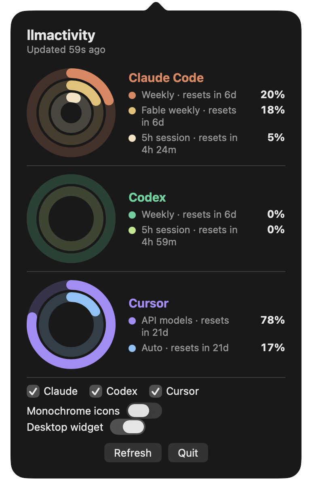
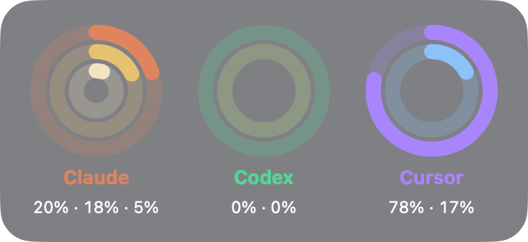

# llmactivity

Apple-Activity-style usage rings for the AI coding tools on your Mac: Claude Code, Codex, Cursor. Each tool gets its own menu bar icon, a popover lists every limit with its reset countdown, and an optional desktop widget puts the same rings on your wallpaper. No login: it reads the credentials the tools already store locally.



## Features

- **One ring stack per installed tool.** A tool with no local login shows nothing at all.
- **Every billing window is a ring**, not just the 5h session. Claude Code gets three, Codex and Cursor get two.
- **Clock order.** The slow budget sits outside, the fast window sits inside. Weekly on the rim, session in the middle.
- **Brand-family colors per ring.** Claude runs warm orange to cream, Codex green to lime, Cursor violet to blue.
- **Rings blend toward red past 80%.** At 100% used the ring is clearly red, so a full budget is obvious at a glance.
- **Reset countdowns** on every row: "resets in 6d", "resets in 4h 24m".
- **Per-tool checkboxes.** Hide any provider to keep the menu bar tidy; the widget drops that column too.
- **Monochrome mode** swaps the icons for template images, so macOS tints them like the system icons.
- **Desktop widget**: a translucent card above the wallpaper and under your app windows. Drag it anywhere, the position sticks.
- **Nothing renders per frame.** The menu bar images are redrawn only when the data or the monochrome setting changes.

## Menu bar

| | |
|---|---|
|  | **Color** (default): each tool keeps its brand tones, so you can tell them apart without hovering. |
|  | **Monochrome**: template images that follow the menu bar, white on dark and black on light. |

## Desktop widget



The same ring stacks, larger, with the tool name and each ring's percent underneath. Toggle it in the popover.

## Providers

| Tool | Rings (outer → inner) | Ring colors | Credential |
|---|---|---|---|
| Claude Code | Weekly · model weekly (e.g. Fable) · 5h session | `#E8845C` `#ECC06F` `#F7E2C0` | Keychain item `Claude Code-credentials` |
| Codex | Weekly · 5h session | `#34D399` `#B8E986` | `~/.codex/auth.json` |
| Cursor | API models · Auto (monthly cycle) | `#A78BFA` `#7DC4FA` | Cursor IDE token in `state.vscdb` |

## How it gets the data

It reads the credentials each tool already wrote to this Mac, then calls that vendor's own usage endpoint: `api.anthropic.com/api/oauth/usage`, `chatgpt.com/backend-api/wham/usage`, `cursor.com/api/usage-summary`. Nothing goes anywhere else. There is no account, no server, no telemetry.

Claude is polled at most once every 5 minutes, because Anthropic rate-limits that usage endpoint hard. Codex and Cursor are polled every 60 seconds. On an HTTP 429 the app honors `Retry-After` and keeps showing the last good numbers.

## Build and install

Requires macOS 13 or later and a Swift 5.9+ toolchain. Pure Swift Package Manager, no Xcode project.

```sh
swift build -c release
.build/release/LLMActivity --dump         # print live limits and exit
.build/release/LLMActivity --parsecheck   # parser self-test
.build/release/LLMActivity --show-popover # open the popover 3s after launch (for screenshots)
scripts/make-app.sh 0.1.0                 # LLMActivity.app (ad-hoc signed)
scripts/make-dmg.sh 0.1.0
```

The app is ad-hoc signed and not notarized, so Gatekeeper blocks the first launch. Either right-click **LLMActivity.app** → **Open** → **Open**, or clear the quarantine flag:

```sh
xattr -cr /Applications/LLMActivity.app
```

It runs as a menu bar accessory with no Dock icon.

## Settings

In the popover: per-tool checkboxes, **Monochrome icons** and **Desktop widget**. Poll interval is a defaults key:

```sh
defaults write com.chocksy.llmactivity pollInterval 30   # seconds, floor 15
```

Claude ignores anything under 5 minutes (see above). Codex and Cursor use `pollInterval`.

## Known limits

No token refresh. If a tool's token expired, the icon dims and the popover says so. Open that tool once and the next poll recovers.
