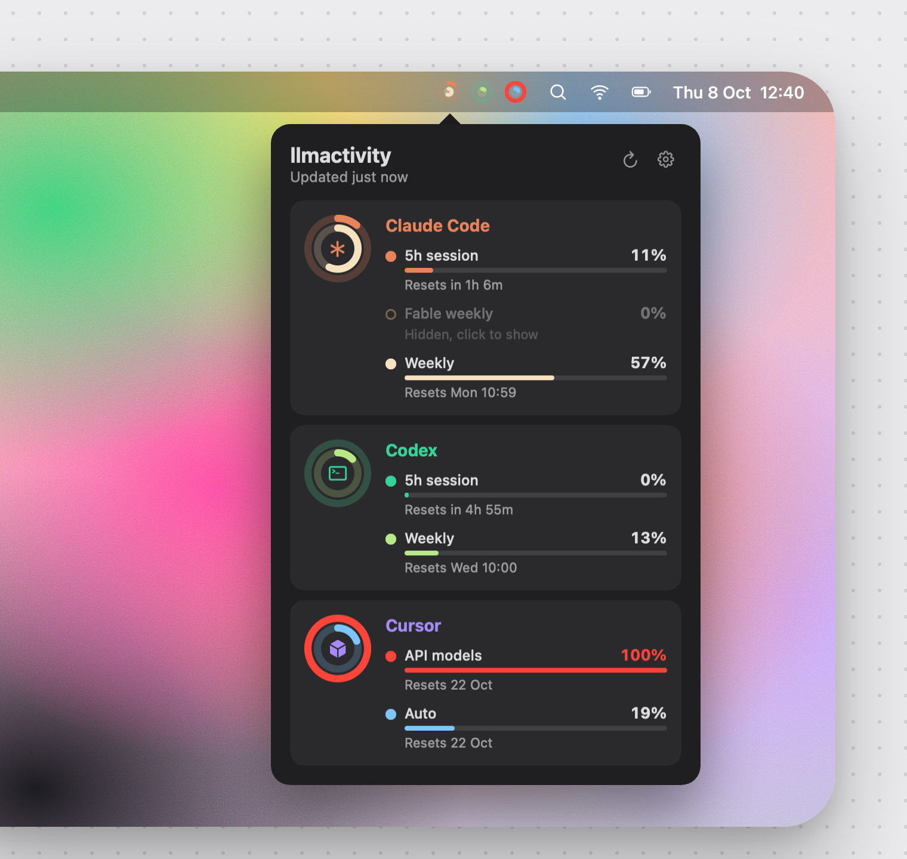
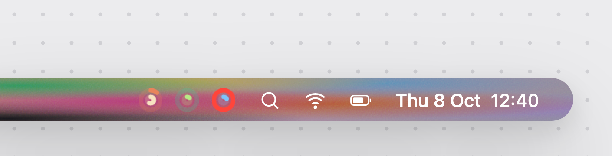
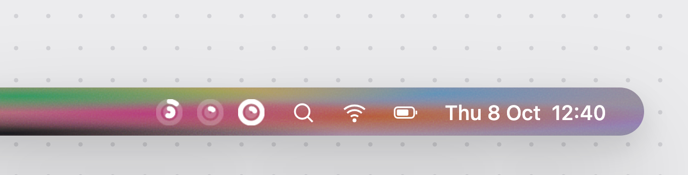
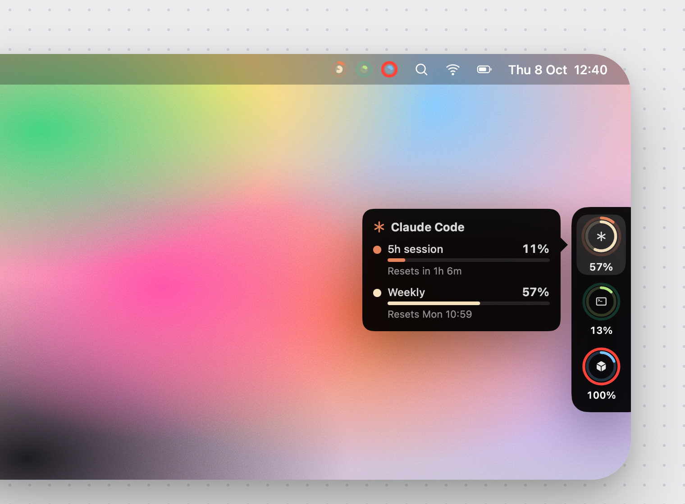
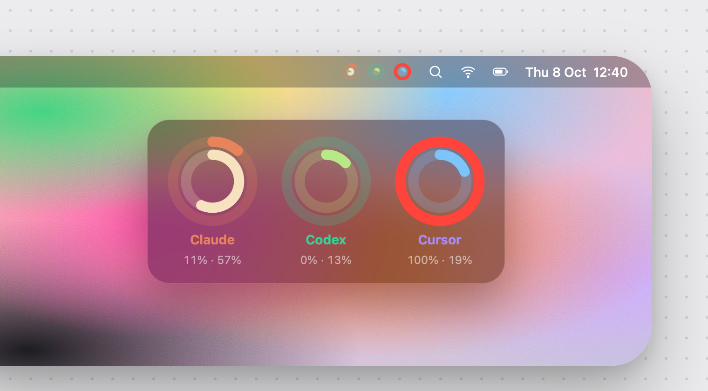
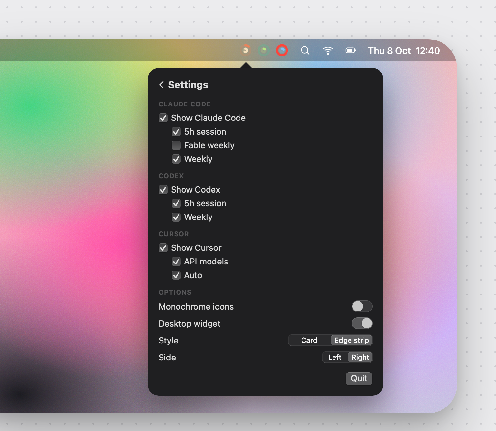

# llmactivity

Apple-Activity-style usage rings for the AI coding tools on your Mac: Claude Code, Codex, Cursor. Each tool gets its own menu bar icon, a popover lists every limit with its reset countdown, and an optional desktop widget puts the same rings on your wallpaper. No login: it reads the credentials the tools already store locally.



## Features

- **One ring stack per installed tool.** A tool with no local login shows nothing at all.
- **Every billing window is a ring**, not just the 5h session. Claude Code gets three, Codex and Cursor get two.
- **Clock order.** The fast window sits outside like a clock's second hand, slower budgets sit toward the center. Session on the rim, weekly in the middle.
- **Brand-family colors per ring.** Claude runs warm orange to cream, Codex green to lime, Cursor violet to blue.
- **Rings warn as they fill.** Past 60% a ring warms toward amber, past 85% toward red, and from 95% it is plain red. The percent turns the same color.
- **Hide single limits.** Click a limit row in the popover, or untick it in Settings, to drop its ring (handy for a model you stopped using).
- **Reset times** on every row: "Resets in 4h 24m", "Resets Thu 10:32", "Resets Oct 22".
- **Settings behind the gear.** The popover shows only usage cards (small ring, bars, reset times). Hide any provider to keep the menu bar tidy; the widget drops that column too.
- **Monochrome mode** swaps the icons for template images, so macOS tints them like the system icons.
- **Desktop widget**, two styles: a translucent card above the wallpaper and under your app windows (drag it anywhere), or a black edge strip docked to a screen edge, above windows. The strip shows each tool's logo inside its rings; hover one and a card slides out with an arrow pointing at it. Pick Left or Right in Settings, or drag the strip to any screen: it snaps to the nearest side and remembers the display.
- **Auto-update.** On launch and once a day it asks the GitHub releases API for the latest tag. A newer version installs itself: it downloads the DMG, checks the app carries our Developer ID signature, swaps the bundle and relaunches. If that fails (say, the app runs from a read-only folder), an "Update to vX" button in the popover retries, then opens the release page.
- **Nothing renders per frame.** The menu bar images are redrawn only when the data or the monochrome setting changes.

## Menu bar

| | |
|---|---|
|  | **Color** (default): each tool keeps its brand tones, so you can tell them apart without hovering. |
|  | **Monochrome**: template images that follow the menu bar, white on dark and black on light. |

## Desktop widget

Two styles, picked in Settings.

**Edge strip:** a black strip docked to a screen edge, above your windows. Each tool's logo sits inside its rings with the fullest limit underneath. Hover one and its card slides out.



**Card:** the same ring stacks, larger, on a translucent card above the wallpaper and under your app windows. Drag it anywhere.



## Providers

| Tool | Rings (outer → inner) | Ring colors | Credential |
|---|---|---|---|
| Claude Code | 5h session · model weekly (e.g. Fable) · Weekly | `#E8845C` `#ECC06F` `#F7E2C0` | Keychain item `Claude Code-credentials` |
| Codex | 5h session · Weekly | `#34D399` `#B8E986` | `~/.codex/auth.json` |
| Cursor | API models · Auto (monthly cycle) | `#A78BFA` `#7DC4FA` | Cursor IDE token in `state.vscdb` |

## How it gets the data

It reads the credentials each tool already wrote to this Mac, then calls that vendor's own usage endpoint: `api.anthropic.com/api/oauth/usage`, `chatgpt.com/backend-api/wham/usage`, `cursor.com/api/usage-summary`. Nothing goes anywhere else. There is no account, no server, no telemetry.

Claude is polled at most once every 5 minutes, because Anthropic rate-limits that usage endpoint hard. Codex and Cursor are polled every 60 seconds. On an HTTP 429 the app honors `Retry-After` and keeps showing the last good numbers.

## Build and install

Requires macOS 13 or later and a Swift 5.9+ toolchain. Pure Swift Package Manager, no Xcode project.

```sh
swift build -c release
.build/release/LLMActivity --dump         # print live limits and exit
.build/release/LLMActivity --parsecheck   # parser self-test
.build/release/LLMActivity --show-popover # open the popover 3s after launch (for screenshots)
scripts/make-app.sh 0.2.0                 # LLMActivity.app (ad-hoc signed)
scripts/make-dmg.sh 0.2.0
```

The app is ad-hoc signed and not notarized, so Gatekeeper blocks the first launch. Either right-click **LLMActivity.app** → **Open** → **Open**, or clear the quarantine flag:

```sh
xattr -cr /Applications/LLMActivity.app
```

It runs as a menu bar accessory with no Dock icon.

## Settings



In the popover's Settings (gear): per-tool and per-limit checkboxes, **Monochrome icons**, **Desktop widget** and its style (Card or Edge strip), and the strip's side (Left or Right). Poll interval is a defaults key:

```sh
defaults write com.chocksy.llmactivity pollInterval 30   # seconds, floor 15
```

Claude ignores anything under 5 minutes (see above). Codex and Cursor use `pollInterval`.

## Known limits

No token refresh. If a tool's token expired, the icon dims and the popover says so. Open that tool once and the next poll recovers.
